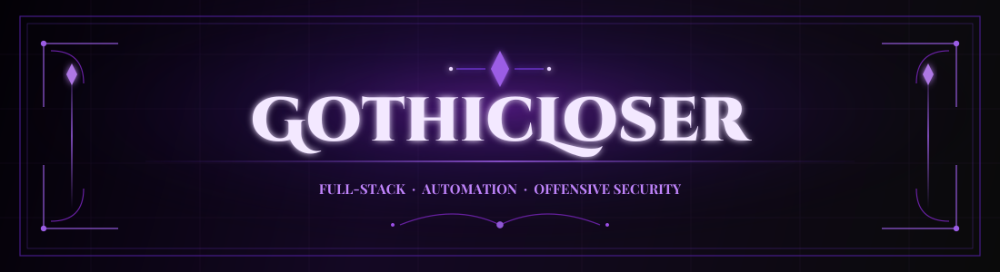
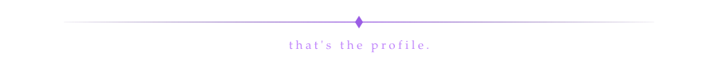

<!--
  GitHub profile README — GothicLoser
  Place your gothic GIF at the repo root as: gif.gif
-->

  

 

 

 

Full-stack developer. Discord &amp; Telegram automation is the day job. 
Red teamer on Telegram — malware, botnets, reverse engineering. 
I build systems. I also take them apart.

 

  

I ship APIs, bots, and UIs that don't fall over when nobody's watching. 
Most of that is Discord and Telegram automation — orchestration, pipelines, ops at scale.

 

When the work gets sharper: red teaming, malware analysis, botnet infrastructure, 
reverse engineering. Learn how threats work. Then use that knowledge.

 

  

| Domain | Focus |
|:------:|:-----:|
| **Full-Stack Web** | architecture · APIs · UI |
| **Discord Automation** | bots · orchestration · tooling |
| **Telegram Automation** | bots · pipelines · ops |
| **Red Teaming** | adversary emulation · offensive security |
| **Malware Research** | analysis · behavior · tooling |
| **Botnet Analysis** | infrastructure · C2 · telemetry |
| **Reverse Engineering** | binaries · protocols · internals |
| **Networking** | sockets · traffic · low-level |

 

  

 

### Languages

 

### Stack

 

<code>discord.js</code> · <code>python-telegram-bot</code> · REST &amp; WebSockets · reverse engineering · packet analysis · Linux · CI/CD

 

  
   
  

